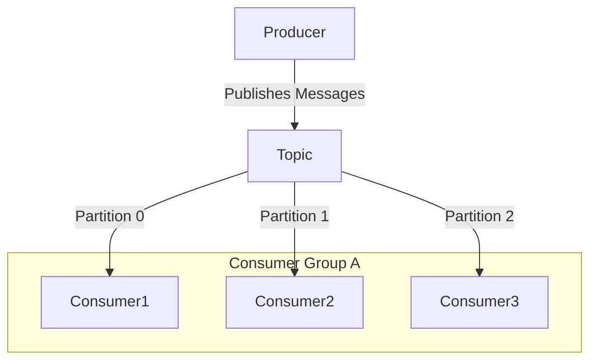
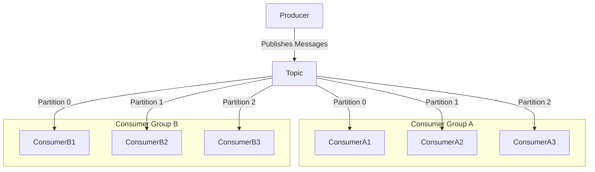
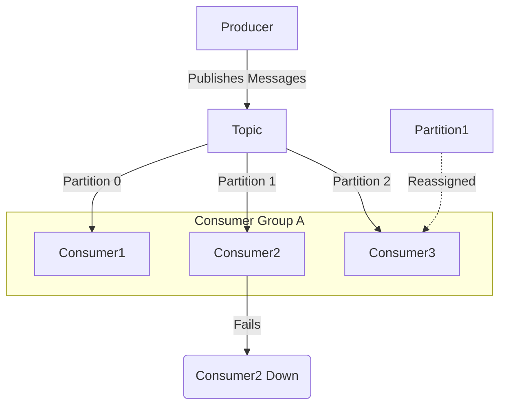
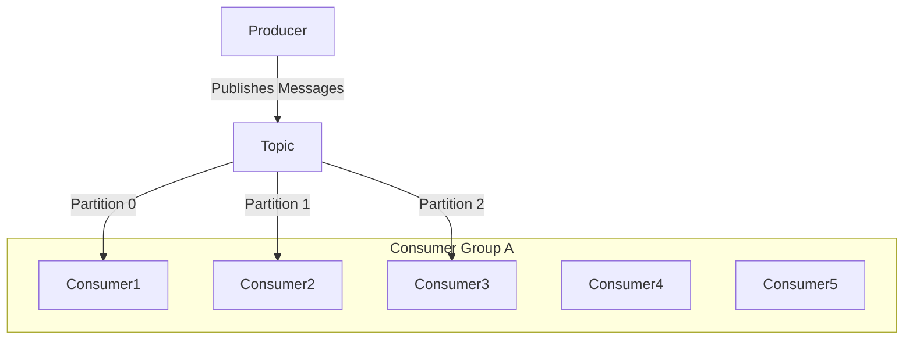
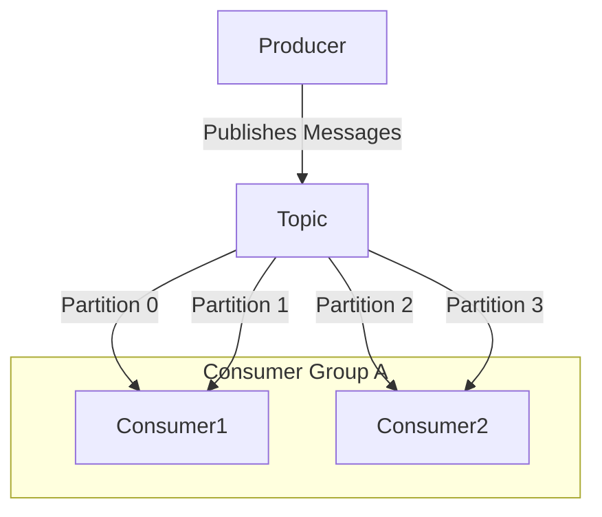
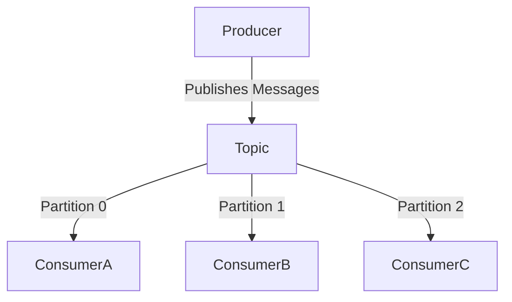
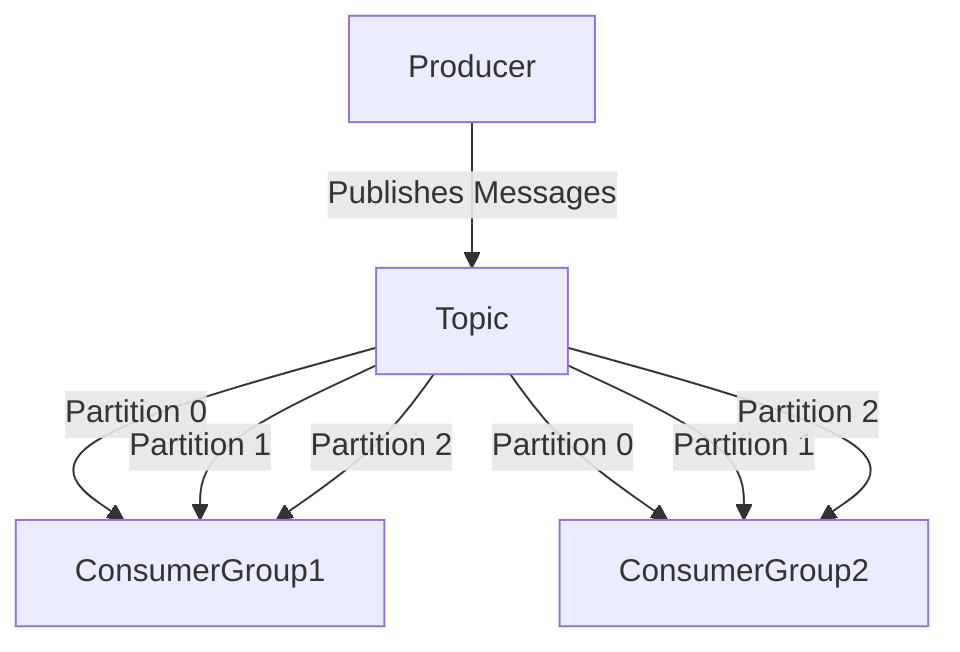

# 📍 Apache Kafka

Apache Kafka is a distributed event streaming platform used for building real-time data pipelines and streaming applications. It is designed to handle high-throughput, fault-tolerant, and scalable messaging. Kafka is widely used for log aggregation, real-time analytics, and event-driven architectures.

In simpler terms, Apache kafka is like a communication system that helps different parts of a computer system exchange data by publishing and subscribing to topics.


# 📍 Kafka's Publisher-Subscriber model


In **Kafka's Publisher-Subscriber model** (Pub-Sub model), producers (publishers) send messages to **topics**, and consumers (subscribers) read messages from these topics. Kafka brokers store and distribute these messages efficiently.  

### **How It Works:**
1. **Producers publish** messages to a topic.  
2. **Kafka brokers store** these messages in **partitions** (subdivisions of topics for scalability).  
3. **Consumers subscribe** to topics and process messages.  
4. **Consumer groups ensure** each message is processed by only one consumer in the group.  


# 📍 **Zomato’s Kafka-based Architecture for Real-Time Delivery Tracking**  

### **Problem with Traditional Architecture**  
In a traditional architecture, Zomato would frequently retrieve and store the **delivery boy’s location** in the **database (DB)** and send updates to the **user**. Given Zomato’s scale, this would lead to:  
- **Excessive DB hits** every second.  
- **Performance issues** due to limited DB throughput.  
- **Risk of DB crashes** from high-frequency reads and writes. 

### **Diagram:**  
```
+------------------+       +------------------+       +------------------+
| Delivery Boy    | -----> |   Database (DB)  | <----- |      User       |
| (Sends Location)|        | (Frequent Writes)|        | (Requests Data) |
+------------------+       +------------------+       +------------------+
                            ▲    ▲    ▲    ▲
                            |    |    |    |
              High DB Load Due to Frequent Writes & Reads
``` 

### **Kafka-based Pub-Sub Model for Zomato**  
To handle high scale and volume efficiently, Zomato can implement a **Kafka-based Publish-Subscribe (Pub-Sub) model**, where:  
- **Producers (Delivery Boys)** publish location updates to **Kafka topics**.  
- **Kafka** efficiently handles high-throughput streaming.  
- **Consumers (Users)** subscribe to receive real-time updates.  
- The **server processes** data and stores it in the DB in bulk after order completion in a **batch process**.  

### **Diagram:**  
```
+------------------+       +------------------+       +------------------+
| Delivery Boy    | -----> |      Kafka       | -----> |      User       |
| (Sends Location)|        | (High Throughput)|        | (Receives Live  |
+------------------+        |  Pub-Sub Model) |        |  Updates)       |
                            +------------------+
                                    │
                                    ▼
                        +----------------------+
                        |   Database (DB)      |
                        | (Bulk Storage After  |
                        |  Order Completion)   |
                        +----------------------+
``` 

### **Why Do We Still Need a Database Along with Kafka?**  
Kafka is a **message broker**, not a **permanent storage solution**. While Kafka can retain messages for a configurable period, we still need a **database** for:  
- **Long-term storage** – Order and delivery history must be stored permanently.  
- **Querying and analytics** – Databases provide structured access to historical data.  
- **Data consistency** – Kafka handles streaming but does not ensure **ACID compliance** like relational databases.  
- **Data retrieval** – If a user wants to check past orders, this data must be stored in a DB, not Kafka.  

### **Comparison Between Traditional DB-Based Approach and Kafka-Based Approach**  

| Feature                     | **Traditional DB-Based Approach** | **Kafka-Based Approach** |
|-----------------------------|----------------------------------|-------------------------|
| **Data Flow**               | Delivery boy updates DB, user fetches from DB | Delivery boy publishes to Kafka, user subscribes to real-time updates |
| **Database Load**           | Very high due to frequent writes and reads | Minimal as updates are stored in Kafka and written to DB in batches |
| **Scalability**             | Limited due to DB bottlenecks | Highly scalable with Kafka's distributed architecture |
| **Real-Time Updates**       | No, updates depend on DB read frequency | Yes, users get instant updates through Kafka |
| **Latency**                 | High due to DB query and write delays | Low as Kafka streams data in real-time |
| **Reliability**             | Risk of DB crashes under high load | High as Kafka provides replication and fault tolerance |
| **Storage Efficiency**      | Inefficient, as every update is stored in the DB | Efficient, as only final delivery data is stored in the DB |
| **System Complexity**       | Simpler but not optimized for scale | Slightly more complex but highly optimized for performance |
| **Cost Efficiency**         | High cost due to heavy DB infrastructure | Lower cost as Kafka handles high throughput without DB dependency |
| **Use Case Suitability**    | Works for small-scale applications | Best for large-scale, high-throughput systems like Zomato |


# 📍 Key Features of Kafka

1. **High Throughput**  
   - Kafka can handle **millions of messages per second** with low latency.  
   - It achieves this by using a **distributed, partitioned, and log-based storage system**.  
   - Messages are written and read in a **sequential** manner, reducing disk I/O overhead.  

2. **Fault Tolerance (Replication)**  
   - Kafka ensures **data reliability** through **replication** across multiple brokers.  
   - Each topic partition has **multiple replicas**, preventing data loss in case of broker failures.  
   - If a leader broker fails, a replica automatically takes over as the new leader.  

3. **Durable**  
   - Kafka persists messages on **disk storage**, ensuring durability.  
   - Messages are retained for a **configurable period** (even if they have been consumed).  
   - This allows for message replay, which is useful for event-driven architectures.  

4. **Scalable**  
   - Kafka scales **horizontally** by adding more brokers to a cluster.  
   - Topics are divided into **partitions**, enabling parallel processing.  
   - Consumer groups allow for **load balancing**, ensuring efficient message consumption.  


# 📍 Kafka Architecture


Kafka follows a **distributed, event-driven, and high-throughput architecture** designed for real-time data streaming. It consists of multiple components working together to enable **efficient message publishing, storage, and consumption**.

### **1. Producer**
- Sends (publishes) messages to **Kafka topics**.
- Can send messages to specific **partitions** within a topic.
- Works asynchronously for **high throughput**.

### **2. Kafka Cluster**
- Consists of multiple **Kafka brokers** (servers) handling message storage and distribution.
- Ensures **fault tolerance and replication** for data reliability.

### **3. Broker**
- A **Kafka server** that stores and manages data.
- Each broker handles a subset of **topic partitions**.
- Kafka can have **multiple brokers**, forming a **cluster** for scalability.

### **4. Topic**
- A logical channel where **messages** are published.
- **Producers write** to topics, and **consumers read** from topics.
- Topics are divided into **partitions** for parallelism.

### **5. Partition**
- A subset of a topic that allows **load distribution** across multiple brokers.
- Each partition is replicated across brokers for **fault tolerance**.
- Consumers read messages **sequentially** from partitions.

### **6. Offset**
- A unique **ID assigned to each message** within a partition.
- Kafka tracks offsets to ensure **message ordering and retrieval**.
- Consumers can store offsets to **resume processing** from the last read position.

### **7. Consumer**
- Subscribes to **Kafka topics** and reads messages.
- Can be part of a **consumer group** for **parallel processing**.
- **Manages offsets** to track message consumption.

### **8. Consumer Group**
- A collection of **consumers reading from the same topic**.
- Each message is **processed by only one consumer per group**, ensuring load balancing.
- Multiple groups can subscribe to the same topic, each processing independently.

### **9. ZooKeeper**
- Manages **Kafka broker metadata, leader election, and configuration**.
- Ensures **broker coordination and failure detection**.
- Required for maintaining **cluster health**.


# 📍 Partition-Consumer Exclusivity and Consumer Groups

Kafka follows a **partition-based parallelism** model where:  
- **One Consumer Can Consume Multiple Partitions**.  
- **One Partition Can Be Consumed by Only One Consumer** at a time.  

This ensures:  
1. **Efficient parallel processing** by distributing partitions across consumers.  
2. **Message order within a partition is maintained**, as only one consumer reads from a partition.  

### **Case 1: One Consumer, Multiple Partitions**
```
+--------------------+
|      TOPIC        |
+--------------------+
| Partition 0       |  ---> Consumer A
| Partition 1       |  ---> Consumer A
| Partition 2       |  ---> Consumer A
+--------------------+
```
- Consumer A is consuming messages from multiple partitions.
- Each partition still has only one consumer.

### **Case 2: Equal Partitions to Consumers (1:1 Mapping)**  
When the number of consumers **matches** the number of partitions, each consumer **exclusively** consumes messages from a single partition.

```
+--------------------+
|      TOPIC        |
+--------------------+
| Partition 0       |  ---> Consumer A
| Partition 1       |  ---> Consumer B
| Partition 2       |  ---> Consumer C
+--------------------+
```
- **Each consumer gets exactly one partition.**  
- **Parallelism is maximized.**  
- **Order is preserved within each partition.**  

### **Case 3: More Consumers Than Partitions (Consumers Remain Idle)**  
When there are **more consumers than partitions**, some consumers remain **idle** as a partition **cannot be shared**.

```
+--------------------+
|      TOPIC        |
+--------------------+
| Partition 0       |  ---> Consumer A
| Partition 1       |  ---> Consumer B
| Partition 2       |  ---> Consumer C
+--------------------+
              |
              |  Consumer D (Idle)
              |  Consumer E (Idle)
```
- **Two consumers are not assigned any partition.**  
- **Adding more consumers than partitions does not improve performance.**  

### **Case 4: Fewer Consumers Than Partitions (Consumers Handle Multiple Partitions)**  
If there are **fewer consumers than partitions**, Kafka **distributes partitions evenly** among the available consumers.

```
+--------------------+
|      TOPIC        |
+--------------------+
| Partition 0       |  ---> Consumer A
| Partition 1       |  ---> Consumer A
| Partition 2       |  ---> Consumer B
| Partition 3       |  ---> Consumer B
| Partition 4       |  ---> Consumer C
+--------------------+
```
- **Each consumer handles multiple partitions.**  
- **Kafka ensures that the partitions are evenly distributed.**  

## Consumer Groups

A **Consumer Group** in Kafka is a collection of consumers that work together to **consume messages from a topic in parallel**. Kafka ensures that each partition is assigned to only one consumer within the same group.  

## **Basic Concept of Consumer Groups**  
- Each **consumer group** subscribes to a topic.
- Kafka distributes **partitions** among consumers in the group.
- If a consumer fails, Kafka **reassigns** its partitions to other consumers in the group.  


- **Each partition is assigned to one consumer within the group.**  
- **Messages are evenly distributed among consumers.**  
- **Scales processing by adding more consumers.**  

## **Multiple Consumer Groups (Pub/Sub Model)**  
- When **multiple consumer groups** subscribe to the same topic, each group **receives a full copy** of the messages.  
- Consumers in different groups operate **independently**.  


- **Each consumer group gets all messages independently.**  
- **Useful for multiple use cases (e.g., analytics and real-time processing).**  

## **Consumer Rebalancing (Failure Handling)**  
- If a consumer **fails**, Kafka **redistributes** its partitions to active consumers.  
- When a new consumer **joins**, Kafka **balances the load**.  


- **If Consumer2 fails, its partition is reassigned to another consumer.**  
- **Kafka ensures continuous processing without data loss.**  

## **More Consumers Than Partitions (Idle Consumers)**  
- When the **number of consumers is greater than the number of partitions**, some consumers remain **idle**.  


- **Consumers 4 and 5 are idle because there are only 3 partitions.**  
- **To optimize, partitions should be equal to or greater than consumers.**  

## **Fewer Consumers Than Partitions (Consumers Handle Multiple Partitions)**  
- If the **number of consumers is less than the number of partitions**, each consumer processes **multiple partitions**.  


- **Consumers distribute partitions dynamically.**  
- **Efficient but may increase processing time per consumer.**  


# 📍**Queue Model vs. Pub/Sub Model in Kafka**  

Kafka supports **both the Queue Model and the Publish-Subscribe (Pub/Sub) Model** through **Consumer Groups**, allowing it to function in different messaging patterns.

## **Queue Model (Point-to-Point Messaging)**
- In a **Queue Model**, multiple consumers act as workers, but **each message is processed by only one consumer**.
- Kafka achieves this using **Consumer Groups**, where partitions are **evenly distributed among consumers**.


- **Messages are load-balanced** across consumers.  
- **No message duplication** within the consumer group.  
- This model is useful for **task processing (e.g., background jobs, event-driven processing)**.

## **Publish-Subscribe (Pub/Sub) Model**
- In **Pub/Sub**, multiple consumers receive **a copy of the same message**.
- Kafka enables this by using **multiple independent consumer groups**.  
- Each group gets **its own copy** of the messages.


- **Each consumer group gets the entire data stream.**  
- **Consumers in different groups do not affect each other.**  
- Used for **real-time analytics, logging, event-driven architectures**.

## **Kafka Consumer Groups: Combining Queue & Pub/Sub Models**
- Kafka's **Consumer Groups enable both models**:
  - Within a **single group**, Kafka works as a **Queue Model**.
  - With **multiple groups**, Kafka behaves as a **Pub/Sub Model**.


- **Each group acts as a queue** (messages distributed across group members).  
- **Multiple groups enable pub/sub** (each group gets all messages).  

---
